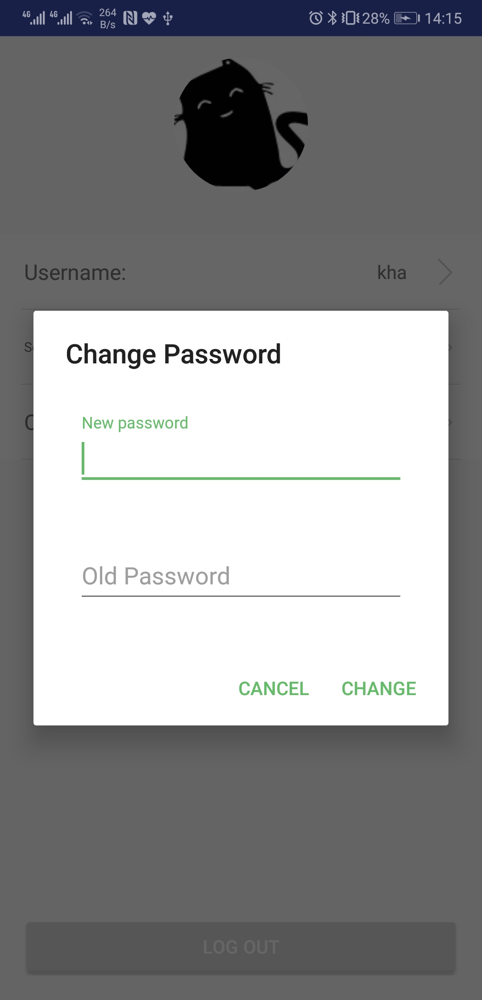
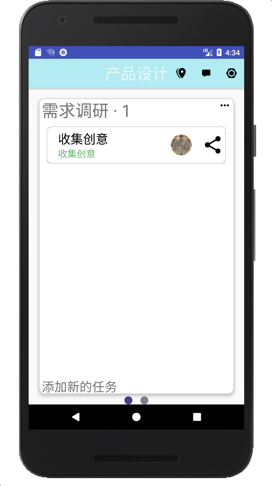

# Comfy


一个提升工作效率的app


## 目录

* [功能](#功能)
  * [账户管理与注册登录](#账户管理与注册登录)
  * [个人](#个人)
  * [团队](#团队)
  * [使用情况](#使用情况)
  * [设置](#设置)
  * [美观](#美观)
* [第三方库](#第三方库)
* [数据库](#数据库)


## 功能

### 账户管理与注册登录

- 注册与登录主界面

  

- 用户管理侧栏

  

- 设置界面

  

- 用户信息和登出界面

  

- 修改用户名和密码

  

- 修改头像

  

### 个人


* 添加个人任务列表


* 添加个人任务

  

* 修改 删除 完成项目

  

* 设置提醒


* 编辑 删除 完成任务列表


- 个人任务分享

  

### 团队


* 创建项目


* 添加任务列表


* 添加任务



* 为成员分配任务


* 修改 删除 完成任务


* 修改 删除 完成任务列表


* 修改 删除 完成项目


* 项目变更通知


- 团队定位

  

- 聊天室

  

### 使用情况

### 美观

- 更换皮肤


## 第三方库

```groovy
implementation 'cn.leancloud.android:avoscloud-sdk:v4.7.3'
implementation('cn.leancloud.android:avoscloud-push:v4.7.3@aar') { transitive = true }
implementation 'cn.leancloud.android:avoscloud-statistics:v4.7.3'
implementation 'cn.leancloud.android:avoscloud-feedback:v4.7.3@aar'
implementation 'cn.leancloud.android:avoscloud-sns:v4.7.3@aar'
implementation 'cn.leancloud.android:qq-sdk:1.6.1-leancloud'
implementation 'cn.leancloud.android:avoscloud-search:v4.7.3@aar'
implementation 'androidx.appcompat:appcompat:1.0.2'
implementation 'androidx.constraintlayout:constraintlayout:1.1.3'
testImplementation 'junit:junit:4.12'
implementation files('./jar/weibo-sdk-android-sso-3.0.1-leancloud.jar')
implementation files(
 './jar/AMap3DMap_6.5.0_AMapNavi_6.5.0_AMapSearch_6.5.0_AMapTrack_1.0.0_AMapLocation_4.4.0_20181122.jar'
)
implementation 'com.google.android.material:material:1.0.0'
implementation 'de.hdodenhof:circleimageview:2.2.0'
implementation 'com.github.PhilJay:MPAndroidChart:v3.1.0-alpha'
implementation 'com.squareup.retrofit2:retrofit:2.4.0'
implementation 'com.squareup.retrofit2:converter-gson:2.4.0'
implementation 'com.squareup.okhttp3:okhttp:3.11.0'
implementation 'io.reactivex.rxjava2:rxjava:2.2.3'
implementation 'io.reactivex.rxjava2:rxandroid:2.1.0'
implementation 'com.squareup.retrofit2:adapter-rxjava2:2.4.0'
implementation 'com.squareup.okhttp3:logging-interceptor:3.11.0'
implementation 'com.github.shem8:material-login:2.1.1'
implementation 'com.google.code.gson:gson:2.8.5'
implementation 'com.loopeer.library:cardstack:1.0.2'
implementation 'org.greenrobot:greendao:3.2.2'
implementation 'com.flyco.tablayout:FlycoTabLayout_Lib:2.1.2@aar'
implementation 'com.leon:lsettingviewlibrary:1.7.0'
implementation 'com.github.yalantis:ucrop:2.2.2'
kapt 'com.github.bumptech.glide:compiler:4.8.0'
implementation 'com.github.bumptech.glide:glide:4.8.0'
implementation 'com.afollestad.material-dialogs:core:2.0.0-rc1'
implementation 'com.afollestad.material-dialogs:input:2.0.0-rc1'
implementation 'jp.wasabeef:recyclerview-animators:3.0.0'
implementation('com.alibaba.android:ultraviewpager:1.0.7.7@aar') {
    transitive = true
}
implementation 'pub.devrel:easypermissions:2.0.0'
implementation 'com.daimajia.swipelayout:library:1.2.0@aar'
implementation 'com.wdullaer:materialdatetimepicker:4.1.0'
implementation 'cn.leancloud.android:chatkit:1.0.6'
implementation 'com.ldoublem.loadingview:loadingviewlib:1.0'
implementation 'com.github.Mindinventory:OverlapImageGalleryView:1.0'
implementation 'com.bilibili:magicasakura:0.1.8@aar'
implementation 'com.nightonke:boommenu:2.1.1'
implementation 'com.github.YiiGuxing:CompositionAvatar:v1.0.4'
implementation 'com.pnikosis:materialish-progress:1.7'
implementation 'com.github.Kennyc1012:BottomSheet:2.4.1'
implementation 'com.ramotion.directselect:direct-select:0.1.0'
implementation 'com.github.YiiGuxing:CompositionAvatar:v1.0.4'
implementation 'com.github.paolorotolo:appintro:v5.1.0'
```


## 数据库

后端数据库使用第三方服务 LeanCloud

